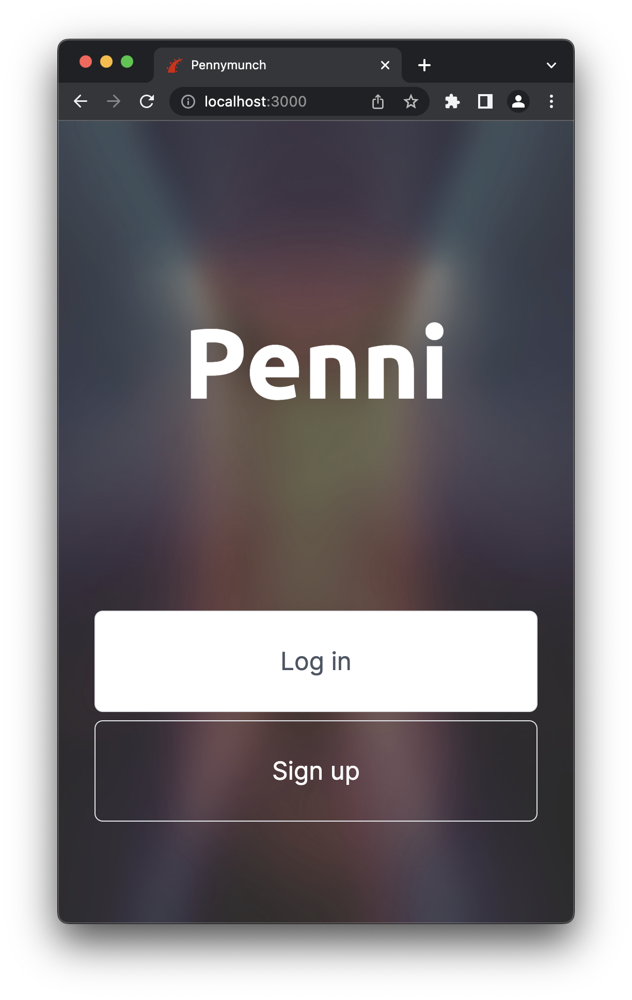
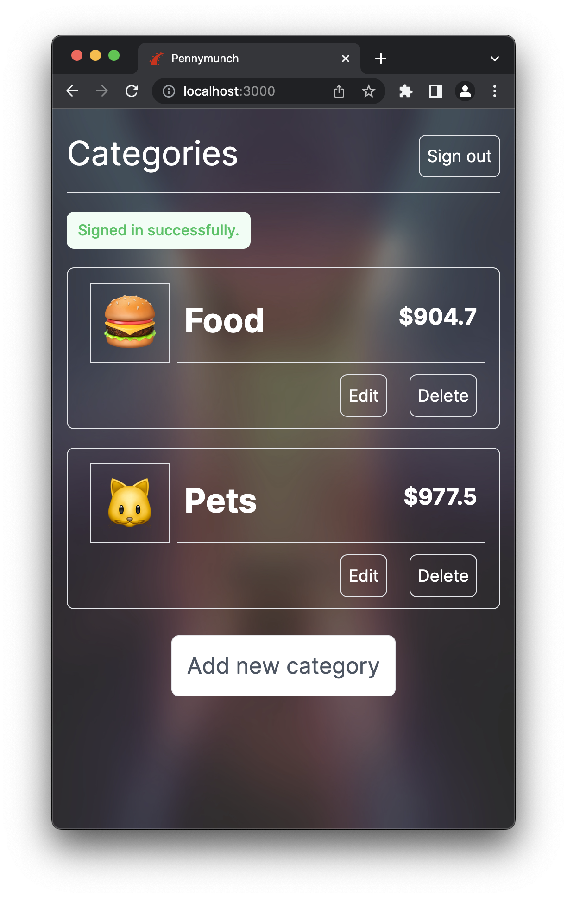
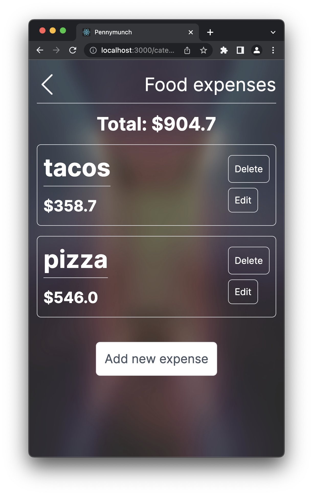

# Penni

This is a MVP app to keep track of your expenses, it was build with love using RoR. It includes features like authentication and integration tests for all main elements.

## Built With

- Ruby
- Ruby on Rails
- Tailwind CSS
- PostgreSQL

## Screenshots and demo links

### Splash screen

### Home screen

### Category screen

[Live Demo Link](https://dry-dusk-84510.herokuapp.com)

[Video tour](https://www.loom.com/share/5d1681de54674d7182bfda887d7b04ce)

## Usage

1. Create an user in the sign up page.
2. Add an expense category with a name and one emoji to represent it.
3. Go into your newly created category to add transactions.
4. Add all the expenses that you have and match with that category.
5. Keep track of every Penni!

## Getting Started

1. Clone the project using `git clone`.
2. Open the project folder with VSCode or any Editor.
3. Open terminal and navigate to the project folder.
4. Run `bundle install`.
5. Run `rails db:migrate`.
6. Run `rails db:create`.
7. Run `rake assets:precompile`.
8. Run `./bin/dev`.

## Tests

1. Open a terminal and `cd` into the project repository.
2. Run `bundle exec rspec` to run all tests.

## Author

👤 **Dante Alvarez**

- GitHub: [@danalvrz](https://github.com/danalvrz)
- Twitter: [@danalvrz](https://twitter.com/danalvrz)
- LinkedIn: [Dante Alvarez](https://www.linkedin.com/in/dante-alvarez-p/)

## 🤝 Contributing

Contributions, issues, and feature requests are welcome!

Feel free to check the [issues page](../../issues).

## 👏 Show your support

Give a ⭐️ if you like this project!

## 📝 License

The basic style idea came from [ Gregoire Vella on Behance](https://www.behance.net/gregoirevella).

